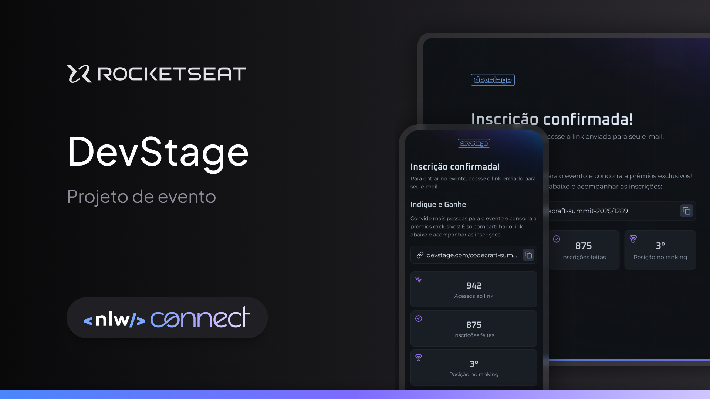

# Projeto NLW Connect

Este é o repositório do projeto NLW Connect desenvolvido durante a Next Level Week da Rocketseat.

## Imagem do Projeto



## Descrição

O projeto é um site responsivo de inscrição e indicação para eventos.

## Tecnologias Utilizadas

- React.js
- Next.js
- Tailwind.css
- TypeScript


## Como Executar

1. Clone o repositório
  ```bash
  git clone https://github.com/Clemilsonchaves/web
  ```
2. Navegue até o diretório do projeto
  ```bash
  cd seu-repositorio
  ```
3. Instale as dependências
  ```bash
  npm install
  ```
4. Execute o projeto
  ```bash
  npm start
  ```

## Contribuição

Contribuições são bem-vindas! Por favor, abra uma issue ou envie um pull request.

## Licença

Este projeto está licenciado sob a Licença MIT. Veja o arquivo [LICENSE](LICENSE) para mais detalhes.